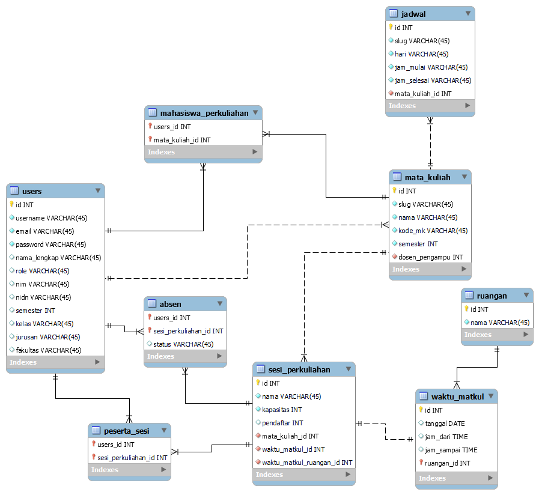

# Yuk Ngantri

## 📢 Tentang

Yuk-Ngantri merupakan sistem antrian masuk kelas berbasis web. Melalui Yuk-Ngantri dosen dapat mengatur gelombang kedatangan mahasiswa dan membuat presensi kehadiran.

[Yuk-Ngantri](https://yuk-ngantri.herokuapp.com)

## 👨🏽‍🤝‍👨🏽 Kontributor

1. [Sobar Pazri](https://www.instagram.com/sobarpazri)
2. [Tarmuji](https://instagram.com/_tarmuji22)

## 📝 ERD

## 🛠 Technology

-   Library **DataTables, SweetAlert, Laravel Excel, Carbon**
-   Template **SBAdmin**
-   Framework **Laravel 9**

## 🌱 UI Framework

-   CSS **Bootstrap & Tailwind**

## ❤ Languages and Tools:

      

